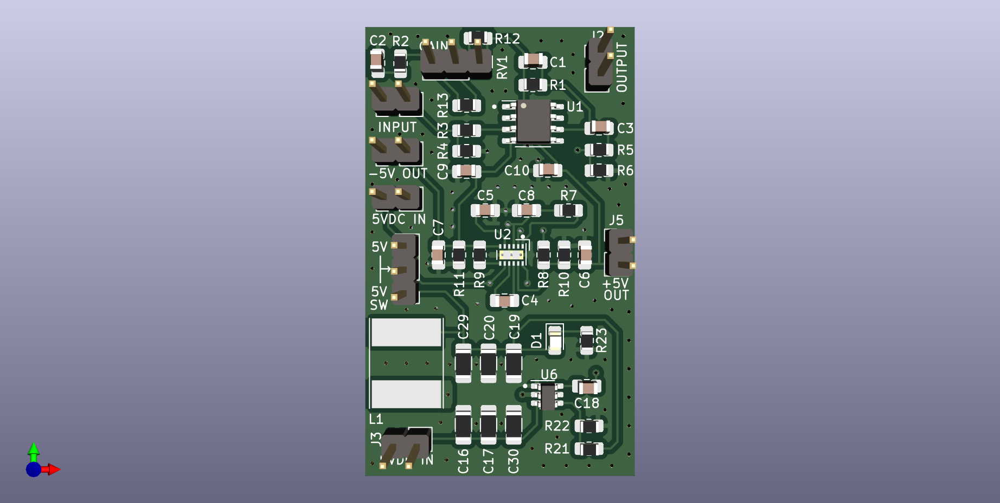

## LM27762 Eval Board with OPAMP test circuit.

This is an eval board for the Texas Instruments [LM27762](hw/datasheets/lm27762.pdf) charge pump IC. It provides a +/-5V regulated split rail from +5.5V input.

To view the schematic click [here](hw/mxr_microamp.pdf).

A render of the board layout is below: 

### OpAmp test circuit

The board comes with an additional OpAmp test circuit based on the popular [MXR MicroAmp](https://www.electrosmash.com/mxr-microamp) "boost" guitar pedal. 

The circuit will accept a +9V power input, so this board can be used as a fully functional MicroAmp clone pedal. 

A reverse audio taper 500K pot should be attached to the `gain` header. If reverse audio cannot be obtained then biasing the potentiometer is possible. See schematic for details.

Wiring for the bypass switch should be done off-board using a 3PDT switch. 